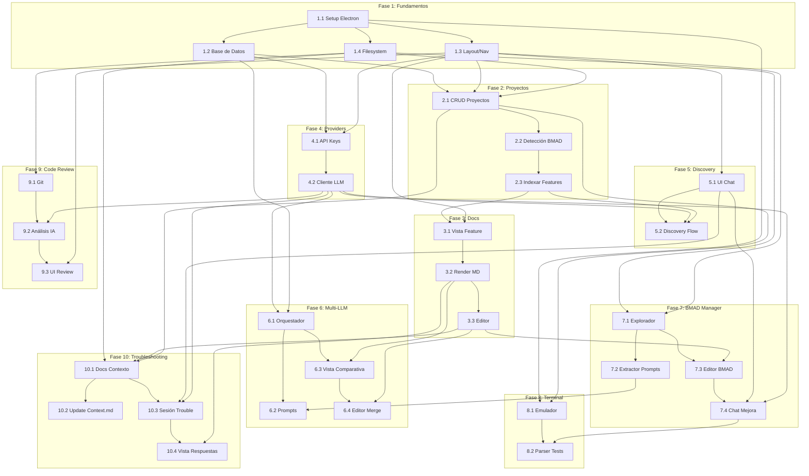

# Plan de Módulos - BMAD Studio V1.0

## Resumen de Fases

| Fase      | Nombre                    | Módulos | Estimación     |
| --------- | ------------------------- | ------- | -------------- |
| 1         | Fundamentos               | 4       | 2-3 días       |
| 2         | Gestión de Proyectos      | 3       | 2-3 días       |
| 3         | Visualización de Docs     | 3       | 2-3 días       |
| 4         | Providers LLM             | 2       | 1-2 días       |
| 5         | Chat Discovery            | 2       | 2-3 días       |
| 6         | Generación Multi-LLM      | 4       | 4-5 días       |
| 7         | BMAD Manager              | 4       | 4-5 días       |
| 8         | Terminal Integrada        | 2       | 2-3 días       |
| 9         | Code Review               | 3       | 3-4 días       |
| 10        | Troubleshooting Multi-LLM | 4       | 3-4 días       |
| **Total** |                           | **31**  | **26-36 días** |

---

## Fase 1: Fundamentos

Base técnica sobre la cual se construye todo lo demás.

### Módulo 1.1: Setup Electron + React

**Descripción:** Configurar proyecto Electron con React, TypeScript, y estructura de carpetas siguiendo mejores prácticas.

**Entidades:** Ninguna (infraestructura)

**Funcionalidades:**

- Proyecto Electron con React 18+ y TypeScript
- Hot reload en desarrollo
- Build para macOS (DMG/App)
- Estructura de carpetas: main/, renderer/, shared/
- IPC bridge tipado entre main y renderer

**Dependencias:** Ninguna

**Criterios de completitud:**

- App abre ventana vacía
- Hot reload funciona
- Build produce .app ejecutable
- TypeScript compila sin errores

---

### Módulo 1.2: Sistema de Base de Datos

**Descripción:** Configurar SQLite con migraciones y capa de acceso a datos.

**Entidades:** Todas (schema inicial)

**Funcionalidades:**

- SQLite integrado con better-sqlite3
- Sistema de migraciones versionadas
- Capa de repositorio para cada entidad
- Encriptación de API keys (keytar o similar)

**Dependencias:** 1.1

**Criterios de completitud:**

- Migraciones corren al iniciar app
- CRUD básico funciona para Project
- API keys se guardan encriptadas
- Tests unitarios de repositorios pasan

---

### Módulo 1.3: Layout Principal y Navegación

**Descripción:** Shell de la aplicación con sidebar, área de contenido y sistema de rutas.

**Entidades:** Ninguna (UI)

**Funcionalidades:**

- Sidebar con secciones: Projects, BMAD, Settings
- Sistema de rutas (react-router o similar)
- Estado global básico (Zustand o Context)
- Tema claro/oscuro con detección de sistema
- Barra de título nativa macOS

**Dependencias:** 1.1

**Criterios de completitud:**

- Navegación entre secciones funciona
- Tema cambia correctamente
- Layout es responsive
- Diseño consistente con macOS

---

### Módulo 1.4: Sistema de Archivos

**Descripción:** Capa de abstracción para operaciones de filesystem.

**Entidades:** Ninguna (servicio)

**Funcionalidades:**

- Leer/escribir archivos con encoding UTF-8
- Crear directorios recursivamente
- Watch de cambios en archivos
- Diálogo nativo de selección de carpeta
- Manejo de errores de permisos

**Dependencias:** 1.1

**Criterios de completitud:**

- Puede seleccionar carpeta con diálogo nativo
- Lee y escribe archivos markdown
- Watch detecta cambios externos
- Errores se manejan gracefully

---

## Fase 2: Gestión de Proyectos

CRUD de proyectos y detección de estructura BMAD.

### Módulo 2.1: Agregar y Listar Proyectos

**Descripción:** Permitir al usuario agregar proyectos existentes y verlos en lista.

**Entidades:** Project

**Funcionalidades:**

- Botón "Agregar Proyecto" abre selector de carpeta
- Detectar nombre del proyecto desde package.json, composer.json, o nombre de carpeta
- Guardar proyecto en SQLite
- Listar proyectos en sidebar con nombre e ícono
- Eliminar proyecto (solo de la app, no del filesystem)

**Dependencias:** 1.2, 1.3, 1.4

**Criterios de completitud:**

- Puede agregar proyecto seleccionando carpeta
- Proyectos aparecen en sidebar
- Puede eliminar proyecto de la lista
- Persiste después de reiniciar app

---

### Módulo 2.2: Detección e Inicialización BMAD

**Descripción:** Detectar si un proyecto tiene estructura BMAD y permitir inicializarla.

**Entidades:** Project (campo has_bmad)

**Funcionalidades:**

- Al agregar proyecto, detectar si existe .dev/
- Si no existe, mostrar prompt para inicializar
- Crear estructura .dev/features/, .dev/context/, .dev/analysis/
- Crear Context.md y Standards.md con templates básicos
- Badge visual indicando estado BMAD del proyecto

**Dependencias:** 2.1

**Criterios de completitud:**

- Detecta correctamente proyectos con/sin BMAD
- Inicialización crea estructura completa
- Templates tienen contenido útil inicial
- Badge refleja estado real

---

### Módulo 2.3: Indexación de Features

**Descripción:** Escanear .dev/features/ e indexar features existentes.

**Entidades:** Feature, Document

**Funcionalidades:**

- Al abrir proyecto, escanear .dev/features/
- Parsear carpetas XXX-nombre para extraer ID y name
- Detectar documentos existentes (Spec, Tech, Steps, Status, Quick)
- Guardar en SQLite para acceso rápido
- Re-escanear cuando se detectan cambios

**Dependencias:** 2.2

**Criterios de completitud:**

- Features existentes aparecen en UI
- Metadata correctamente parseada
- Documentos vinculados a features
- Watch actualiza índice automáticamente

---

## Fase 3: Visualización de Documentación

Renderizado y edición de documentos markdown.

### Módulo 3.1: Vista de Feature

**Descripción:** Pantalla principal de una feature mostrando sus documentos.

**Entidades:** Feature, Document

**Funcionalidades:**

- Tabs para cada documento (Spec, Tech, Steps, Status)
- Indicador visual de documentos existentes vs faltantes
- Metadata de feature: ID, nombre, estado, fechas
- Navegación entre features (anterior/siguiente)
- Breadcrumb: Proyecto > Feature > Documento

**Dependencias:** 2.3, 1.3

**Criterios de completitud:**

- Puede navegar a cualquier feature
- Tabs muestran documentos correctos
- Estado visual claro de qué existe
- Navegación fluida

---

### Módulo 3.2: Renderizado Markdown

**Descripción:** Mostrar documentos markdown con formato rico.

**Entidades:** Document

**Funcionalidades:**

- Renderizado de markdown con soporte completo (tablas, código, listas)
- Syntax highlighting para bloques de código
- Renderizado de diagramas Mermaid
- Tabla de contenidos generada automáticamente
- Scroll sincronizado con TOC

**Dependencias:** 3.1

**Criterios de completitud:**

- Markdown se ve correctamente formateado
- Código tiene syntax highlighting
- Mermaid renderiza diagramas
- TOC permite navegación rápida

---

### Módulo 3.3: Editor de Documentos

**Descripción:** Permitir edición de documentos con preview en vivo.

**Entidades:** Document

**Funcionalidades:**

- Modo edición con editor de texto (CodeMirror o Monaco)
- Split view: editor + preview
- Guardado automático (debounced)
- Guardado manual con Cmd+S
- Historial de cambios local (últimas 10 versiones)

**Dependencias:** 3.2

**Criterios de completitud:**

- Puede editar cualquier documento
- Preview actualiza en tiempo real
- Cambios se guardan en filesystem
- Puede revertir a versión anterior

---

## Fase 4: Configuración de Providers LLM

Gestión de API keys y selección de modelos.

### Módulo 4.1: Gestión de API Keys

**Descripción:** Pantalla de settings para configurar providers.

**Entidades:** LLMProvider

**Funcionalidades:**

- Lista de providers: OpenAI, Google, DeepSeek, Anthropic
- Input para API key (masked)
- Botón "Test Connection" para validar key
- Toggle para habilitar/deshabilitar provider
- Selector de modelo por defecto

**Dependencias:** 1.2, 1.3

**Criterios de completitud:**

- Puede agregar API key para cada provider
- Test connection funciona y muestra resultado
- Keys persisten encriptadas
- Toggle habilita/deshabilita correctamente

---

### Módulo 4.2: Cliente LLM Unificado

**Descripción:** Servicio que abstrae llamadas a diferentes LLMs.

**Entidades:** Ninguna (servicio)

**Funcionalidades:**

- Interfaz común: `chat(messages, options): AsyncStream<string>`
- Implementaciones para OpenAI, Google, DeepSeek, Anthropic
- Streaming de respuestas
- Manejo de errores y reintentos
- Tracking de tokens consumidos

**Dependencias:** 4.1

**Criterios de completitud:**

- Puede llamar a cualquier provider configurado
- Streaming funciona correctamente
- Errores se propagan con mensajes claros
- Tokens se registran en LLMProvider

---

## Fase 5: Chat Discovery

Interfaz de chat para explorar ideas antes de documentar.

### Módulo 5.1: UI de Chat

**Descripción:** Componente de chat reutilizable con historial.

**Entidades:** Ninguna (componente UI)

**Funcionalidades:**

- Lista de mensajes con burbujas user/assistant
- Input de texto con envío por Enter
- Indicador de "typing" durante streaming
- Renderizado markdown en respuestas
- Scroll automático a último mensaje

**Dependencias:** 1.3

**Criterios de completitud:**

- Mensajes se muestran correctamente
- Streaming se ve en tiempo real
- Markdown renderiza en respuestas
- UX fluida y responsive

---

### Módulo 5.2: Discovery Flow

**Descripción:** Flujo completo de discovery para nueva feature.

**Entidades:** Feature (creación), GenerationSession

**Funcionalidades:**

- Botón "Nueva Feature" abre modal de Discovery
- Selector de provider para Discovery
- System prompt con rol de Product Planner
- Inyección de contexto del proyecto (Context.md)
- Botón "Generar Documentación" al finalizar
- Extracción de contexto del chat para siguiente fase

**Dependencias:** 5.1, 4.2, 2.3

**Criterios de completitud:**

- Puede iniciar chat de Discovery
- Contexto del proyecto se incluye
- Chat funciona con streaming
- Puede transicionar a generación de docs

---

## Fase 6: Generación Multi-LLM

Core del producto: generar documentos con múltiples LLMs y mergear.

### Módulo 6.1: Orquestador de Generación

**Descripción:** Servicio que coordina llamadas paralelas a múltiples LLMs.

**Entidades:** GenerationSession, GenerationResult

**Funcionalidades:**

- Crear GenerationSession con providers seleccionados
- Ejecutar llamadas en paralelo (Promise.all)
- Guardar cada resultado independientemente
- Manejar fallos parciales (si un provider falla, continuar con otros)
- Actualizar estado de sesión en tiempo real

**Dependencias:** 4.2, 1.2

**Criterios de completitud:**

- Puede llamar N providers en paralelo
- Resultados se guardan correctamente
- Fallos no detienen otros providers
- Estado de sesión es consistente

---

### Módulo 6.2: Prompts por Documento

**Descripción:** Sistema de prompts optimizados para cada tipo de documento, basados en los comandos BMAD existentes.

**Entidades:** Ninguna (templates)

**Funcionalidades:**

- Prompt template para Spec basado en plan-spec.md:
  - Rol de Product Planner
  - Preguntas de discovery: problema, impacto, usuarios, user stories
  - Secciones requeridas: Problema, Solución, Beneficios, Reglas, Edge cases, KPIs, Out of Scope
  - Referencia a templates de ~/.claude/skills/\_shared/templates/spec.md
- Prompt template para Tech basado en plan-tech.md:
  - Requiere Spec.md como input
  - Restricción crítica: NO código de implementación, solo diseño arquitectónico
  - Secciones: Resumen técnico, Arquitectura, Modelos/Datos, APIs, Flujos Mermaid, Decisiones, Testing, Riesgos
  - Firmas de métodos sin cuerpo, contratos en tablas
- Prompt template para Steps basado en plan-steps.md:
  - Requiere Spec.md + Tech.md como input
  - Restricción crítica: NO código, solo acciones en prosa
  - Pasos de 15-60 minutos con checkpoints
  - Fases claras: DB → Backend → Frontend → Tests
  - Análisis de Design System para frontend
- Prompt template para Quick basado en plan-quick.md:
  - Para features <2h sin DB ni múltiples flujos
  - Estructura compacta: QUÉ, CÓMO, PASOS
  - 3-5 pasos de 15-30 min
- Inyección de contexto obligatorio:
  - Context.md (stack, arquitectura, inventario)
  - Standards.md (convenciones, límites)
  - Documentos previos de la feature
  - Chat history del Discovery

**Dependencias:** 6.1

**Criterios de completitud:**

- Cada documento tiene prompt dedicado que replica lógica del comando BMAD
- Restricciones críticas (no código) están enforceadas en prompts
- Prompts producen output estructurado compatible con BMAD
- Resultados son parseables para vista comparativa

---

### Módulo 6.3: Vista Comparativa

**Descripción:** UI para comparar resultados de múltiples LLMs.

**Entidades:** GenerationSession, GenerationResult

**Funcionalidades:**

- Modo "Lado a lado": 2-3 columnas con documentos completos
- Modo "Por sección": dropdown por sección, ver cada versión
- Highlighting de diferencias entre versiones
- Indicadores: tiempo de generación, tokens usados
- Botón para seleccionar versión completa o ir a merge

**Dependencias:** 6.1, 3.2

**Criterios de completitud:**

- Ambos modos de visualización funcionan
- Puede cambiar entre modos fluidamente
- Diferencias son visualmente claras
- Performance aceptable con docs largos

---

### Módulo 6.4: Editor de Merge

**Descripción:** Herramienta para combinar secciones de diferentes fuentes.

**Entidades:** GenerationResult (campo selected_sections)

**Funcionalidades:**

- Vista por secciones del documento
- Para cada sección: selector de fuente (LLM A, B, C, o Custom)
- Si elige Custom: editor inline para esa sección
- Preview del documento mergeado en tiempo real
- Botón "Guardar como Spec/Tech/Steps"
- Guardar documento final en .dev/features/

**Dependencias:** 6.3, 3.3

**Criterios de completitud:**

- Puede seleccionar fuente por sección
- Puede editar secciones custom
- Preview refleja selecciones
- Guarda documento válido en filesystem

---

## Fase 7: BMAD Manager

Gestión y mejora de comandos y skills.

### Módulo 7.1: Explorador BMAD

**Descripción:** Vista de archivos de comandos y skills con soporte para dos ubicaciones.

**Entidades:** BMADCommand, BMADSkill

**Funcionalidades:**

- Configurar rutas BMAD:
  - Global path (default ~/.claude/) - donde Claude Code lee
  - Repo path (opcional) - donde está tu repo para git
- Escanear y listar comandos (/commands/) de ambas ubicaciones
- Escanear y listar skills (/skills/) de ambas ubicaciones
- Parsear frontmatter para metadata (description, argument-hint, allowed-tools)
- Vista en árbol por carpeta
- Detectar helpers compartidos (\_shared/)
- Indicador de estado de sync por archivo:
  - ✓ Sincronizado (igual en ambos)
  - ↑ Solo en global (pendiente de copiar a repo)
  - ↓ Solo en repo (pendiente de instalar)
  - ⚡ Conflicto (diferente en ambos)
- Botón "Sincronizar todo" para forzar sync

**Dependencias:** 1.4, 1.3

**Criterios de completitud:**

- Detecta comandos y skills de ambas ubicaciones
- Metadata se parsea correctamente
- Estado de sync visible por archivo
- Puede sincronizar archivos individuales o todos

---

### Módulo 7.2: Extractor de Lógica de Prompts

**Descripción:** Analizar comandos BMAD para extraer la lógica que se usará en los prompts multi-LLM.

**Entidades:** BMADCommand (campo extracted_prompt_logic)

**Funcionalidades:**

- Parsear plan-spec.md, plan-tech.md, plan-steps.md, plan-quick.md
- Extraer secciones clave:
  - Preguntas que hace al usuario
  - Secciones requeridas en el output
  - Restricciones críticas (ej: "NO código de implementación")
  - Referencias a templates
  - Contexto que debe inyectarse
- Parsear helpers (dev-helper.md, testing-helper.md, etc.)
- Generar prompt base para cada tipo de documento
- Permitir override manual del prompt extraído
- Sincronizar cuando el comando BMAD cambia

**Dependencias:** 7.1

**Criterios de completitud:**

- Extrae lógica de los 4 comandos de planificación
- Genera prompts funcionales para cada documento
- Los prompts respetan restricciones críticas
- Sincroniza con cambios en ~/.claude/

---

### Módulo 7.3: Editor BMAD

**Descripción:** Editar comandos y skills con preview.

**Entidades:** BMADCommand, BMADSkill

**Funcionalidades:**

- Editor markdown con syntax highlighting
- Preview del documento
- Validación de frontmatter
- Backup automático antes de guardar
- Historial de versiones por archivo
- Diff visual entre versiones

**Dependencias:** 7.1, 3.3

**Criterios de completitud:**

- Puede editar cualquier comando/skill
- Backups se crean automáticamente
- Puede revertir a versión anterior
- Cambios se guardan en filesystem

---

### Módulo 7.4: Chat de Mejora BMAD

**Descripción:** Chat con IA para mejorar comandos/skills basándose en errores.

**Entidades:** ImprovementSuggestion

**Funcionalidades:**

- Input para describir error encontrado
- Opción de pegar output de test, log de qa-manual, o finding de code review
- Contexto automático: comando/skill relacionado, helpers usados
- IA analiza y sugiere qué archivo modificar
- Genera diff con cambios propuestos
- Botones: Aprobar (aplica cambio), Rechazar, Editar
- Historial de sugerencias aprobadas/rechazadas
- Re-extracción de prompt logic si se modifica comando de planificación

**Dependencias:** 7.3, 5.1, 4.2

**Criterios de completitud:**

- Chat entiende contexto de error
- Sugiere archivo correcto a modificar
- Diff es aplicable y correcto
- Aprobar actualiza archivo real
- Si modifica plan-\*.md, re-extrae prompt logic

---

## Fase 8: Terminal Integrada

Ejecutar comandos y capturar output.

### Módulo 8.1: Emulador de Terminal

**Descripción:** Terminal embebida en la aplicación.

**Entidades:** Ninguna (componente)

**Funcionalidades:**

- PTY (pseudo-terminal) con node-pty
- Renderizado con xterm.js
- Directorio inicial: proyecto seleccionado
- Soporte de colores ANSI
- Historial de comandos
- Múltiples tabs de terminal

**Dependencias:** 1.1, 2.1

**Criterios de completitud:**

- Terminal funciona como terminal real
- Colores se renderizan correctamente
- Puede ejecutar cualquier comando
- Múltiples tabs funcionan

---

### Módulo 8.2: Parser de Tests

**Descripción:** Detectar y parsear resultados de tests.

**Entidades:** Ninguna (servicio)

**Funcionalidades:**

- Detectar framework de tests (Jest, PHPUnit, pytest, etc.)
- Parsear output para extraer: passed, failed, errors
- Resumen visual de resultados
- Extraer mensaje de error de tests fallidos
- Botón "Reportar a BMAD" pre-llena contexto

**Dependencias:** 8.1, 7.3

**Criterios de completitud:**

- Detecta framework común
- Parsea resultados correctamente
- Resumen muestra stats claras
- Errores se extraen para feedback

---

## Fase 9: Code Review

Análisis de código con IA antes de merge.

### Módulo 9.1: Integración Git

**Descripción:** Operaciones git necesarias para code review.

**Entidades:** CodeReviewSession

**Funcionalidades:**

- Detectar si proyecto tiene git
- Obtener rama actual
- Listar ramas disponibles
- Obtener diff entre ramas
- Listar archivos modificados con contenido

**Dependencias:** 1.4

**Criterios de completitud:**

- Detecta git correctamente
- Obtiene rama actual
- Diff es preciso
- Archivos modificados se listan con diff

---

### Módulo 9.2: Análisis con IA

**Descripción:** Enviar código a IA para análisis.

**Entidades:** CodeReviewSession, CodeReviewFinding

**Funcionalidades:**

- Construir prompt con: diff, Context.md, Spec, Tech
- Prompt especializado para detectar: duplicación, misplacement, reusability, style
- Parsear respuesta estructurada (JSON)
- Crear findings en base de datos
- Manejar archivos grandes (chunking si necesario)

**Dependencias:** 9.1, 4.2

**Criterios de completitud:**

- Prompt produce findings útiles
- Respuesta se parsea correctamente
- Findings tienen toda la metadata
- Funciona con proyectos reales

---

### Módulo 9.3: UI de Review

**Descripción:** Interfaz para ver y actuar sobre findings.

**Entidades:** CodeReviewFinding

**Funcionalidades:**

- Lista de findings agrupable por: archivo, severidad, categoría
- Vista de detalle con código resaltado
- Acciones: Ignorar, Crear Issue (futuro), Reportar a BMAD
- Filtros por severidad y categoría
- Resumen ejecutivo del review

**Dependencias:** 9.2, 1.3

**Criterios de completitud:**

- Findings se muestran claramente
- Agrupación y filtros funcionan
- Puede ignorar findings
- Puede enviar a BMAD para mejora

---

## Diagrama de Dependencias

---

## Fase 10: Troubleshooting Multi-LLM

Consultar múltiples LLMs cuando Claude Code se atora.

### Módulo 10.1: Gestión de Documentos de Contexto

**Descripción:** CRUD y sincronización de documentos de contexto del proyecto.

**Entidades:** ContextDocument

**Funcionalidades:**

- Detectar documentos de contexto existentes:
  - .dev/context/Context.md
  - .dev/context/Standards.md
  - CLAUDE.md (raíz del proyecto)
  - AGENTS.md (raíz del proyecto)
  - Archivos custom definidos por usuario
- Editar documentos con editor markdown + preview
- Watch de cambios externos en filesystem
- Detección de conflictos (cambio local vs externo)
- Resolver conflictos: local, externo, o merge manual
- Historial de versiones por documento

**Dependencias:** 1.4, 3.3, 2.1

**Criterios de completitud:**

- Detecta todos los documentos de contexto
- Edición funciona con preview
- Conflictos se detectan y resuelven
- Historial disponible por documento

---

### Módulo 10.2: Actualización Inteligente de Context.md

**Descripción:** Escanear el proyecto y sugerir actualizaciones al inventario de Context.md.

**Entidades:** ContextDocument

**Funcionalidades:**

- Escanear proyecto según stack detectado:
  - Laravel: Actions, Services, Controllers, Models, etc.
  - React: Components, Hooks, Utils, Pages, etc.
  - Vue/Nuxt: Components, Composables, Stores, etc.
  - Swift: ViewModels, Services, Views, etc.
- Comparar con secciones existentes en Context.md
- Generar diff de cambios sugeridos
- Mostrar: nuevos items, items eliminados, items modificados
- Aplicar cambios selectivamente
- Actualizar timestamp de "última actualización"

**Dependencias:** 10.1, 1.4

**Criterios de completitud:**

- Escanea correctamente según stack
- Diff es preciso y legible
- Puede aplicar cambios parciales
- No sobrescribe secciones manuales

---

### Módulo 10.3: Sesión de Troubleshooting

**Descripción:** Interfaz para describir un problema y compartir contexto.

**Entidades:** TroubleshootingSession

**Funcionalidades:**

- Formulario de problema:
  - Descripción del problema (textarea)
  - Pegar error/log (código)
  - Vincular a feature (opcional)
- Selector de archivos del proyecto:
  - Árbol de archivos navegable
  - Checkbox para seleccionar múltiples
  - Preview del archivo antes de incluir
  - Límite de tokens estimado
- Carga automática de documentos de contexto:
  - CLAUDE.md / AGENTS.md
  - Context.md, Standards.md
  - Spec.md/Tech.md si hay feature vinculada
- Selector de providers a consultar
- Botón "Consultar" que inicia generación paralela

**Dependencias:** 10.1, 5.1, 4.2

**Criterios de completitud:**

- Puede describir problema claramente
- Puede seleccionar archivos del proyecto
- Contexto se carga automáticamente
- Puede iniciar consulta a múltiples LLMs

---

### Módulo 10.4: Vista de Respuestas de Troubleshooting

**Descripción:** Mostrar y comparar respuestas de múltiples LLMs al problema.

**Entidades:** TroubleshootingResponse

**Funcionalidades:**

- Vista en tabs: una tab por LLM
- Vista unificada: todas las respuestas en scroll
- Renderizado markdown con syntax highlighting para código
- Botón "Marcar como útil" por respuesta
- Botón "Copiar código" para snippets
- Botón "Copiar para Claude Code" (formatea respuesta para pegar)
- Marcar sesión como resuelta con notas
- Guardar qué respuestas se usaron en la solución

**Dependencias:** 10.3, 3.2

**Criterios de completitud:**

- Ambas vistas funcionan
- Código se renderiza con highlighting
- Copiar funciona correctamente
- Historial de sesiones guardado

---

## Recomendaciones de Implementación

### Stack Sugerido

- **Electron**: v28+
- **React**: 18+
- **TypeScript**: 5+
- **UI**: Tailwind + shadcn/ui (consistente con macOS)
- **State**: Zustand
- **DB**: better-sqlite3
- **Terminal**: node-pty + xterm.js
- **Markdown**: react-markdown + remark-gfm + rehype-highlight
- **Mermaid**: mermaid.js
- **Git**: simple-git

### Orden de Desarrollo Sugerido

1. Fases 1-2 primero (base sólida)
2. Fase 4 antes de 5-6 (providers necesarios)
3. Fase 3 puede ir en paralelo con 4
4. Fases 5-6 son el core, dedicar tiempo
5. Fases 7-10 pueden desarrollarse en cualquier orden después
6. Fase 10 (Troubleshooting) puede priorizarse si es pain point frecuente
